<!-- Repo-relative, not a raw.githubusercontent.com URL: while this repository is private,
     raw/ answers 404 without a token and the image renders broken. GitHub resolves a relative
     path for the viewer either way. This file is also the PyPI long description, where nothing
     relative resolves — so once the repo is public and the package is published, this is the
     one line to switch to the absolute raw URL. -->
<p align="center">
  
</p>

# OKF Loremaster

**Turns a research question into a browsable, cited, machine-readable evidence corpus.**

It searches PubMed and PubMed Central (PMC, NIH's free full-text archive), screens the results down
to a corpus a person could actually read, pulls structured evidence out of the full text where the
license allows, and writes a folder of
markdown in [Open Knowledge Format](https://cloud.google.com/blog/products/data-analytics/how-the-open-knowledge-format-can-improve-data-sharing)
(OKF v0.2) — plus a vector index built from those same files.

```bash
okf-loremaster build "predictors of 30-day readmission after heart failure hospitalization"
```

That is the whole system. One command, running unattended, from question to finished bundle. At the
end it asks what you want to keep: the OKF corpus, the vector store, or both.

Under the hood it is an agentic system consisting of **five agents, each with an associated job**,
wrapped in ordinary code that checks their work and builds the corpora.

[Suggested use case](#suggested-use-case) · [What you get](#what-you-get) ·
[How a run works](#how-a-run-works) · [Install](#install) · [Configure](#configure) ·
[Running it](#running-it) · [Why OKF](#why-open-knowledge-format) ·
[The downstream contract](#what-downstream-can-rely-on)

---

## Suggested use case

After producing a bundle with OKF Loremaster, it can be plugged into
[**AFC Forge**](https://github.com/PFreda-Lab/afc-forge), an agentic system for constructing
clinical feature sets for downstream machine learning prediction and/or statistical analysis.
Each bundle gets its own specialized agent that reads it to identify potential features — an OKF
agent for the markdown corpus, a RAG agent for the vector store.

---

## What you get

```
bundles/hf-readmission/
├── charter.yaml          # what the run decided to look for — edit and rerun from this
├── run.log               # the full-screen interface's log pane, as plain text
├── okf/                  # the corpus: markdown, one file per paper
│   ├── index.md
│   ├── predictors.md     # what recurs across the topics, and where to read it
│   ├── search.md         # every query, why it was asked, and what PubMed made of it
│   ├── log.md            # what ran, what it found, what it cost
│   ├── charter.yaml      # a copy, so okf/ still says what it was built for on its own
│   ├── _catalog.jsonl
│   ├── resource_descriptor.yaml
│   └── <topic>/          # one folder per topic, each with its own index.md
└── vectors/              # Chroma store, built by walking okf/
```

A **topic** is a sub-domain of the one subject the whole bundle is about. Ask for predictors of
heart-failure readmission and the topics are the separate kinds of explanation a reader would go
looking for — what the patient arrived with, how they were treated, what happened after discharge —
not chapters of a report. The charter picks them before anything is searched, and every stage after
that files papers under them.

Move it with `cp -r`. Nothing records an absolute path, and `okf/` and `vectors/` can each be
attached downstream on their own.

### One paper

````markdown
---
title: "Effects of different exercise modalities on CD4 count in people living with HIV"
domain: "exercise-and-immune-markers"
description: "Aerobic and high-intensity training raised CD4 count; other modalities did not."
tags: ["CD4 count", "aerobic training", "meta-analysis"]
study_design: "systematic review and meta-analysis"
strength: "moderate"
strength_score: "0.66"
text_basis: "abstract"
license: "publisher copyright"
export_safe: "false"
generated: {by: "okf-loremaster/extract/<model-id>", at: "2026-03-21T11:31:58Z"}
sources: [{id: "pmid:33745404", resource: "https://pubmed.ncbi.nlm.nih.gov/33745404/"}]
---

# Bottom line

Aerobic training and high-intensity training raised CD4 count; the other modalities and
intensities did not.

- **Design** — systematic review and meta-analysis
- **Read from** — the abstract only
- **Evidence strength** — moderate (0.66) — nothing to score on size or adjustment

# Predictors reported

| # | Predictor | Operationalization | Timing | Outcome | Type | Effect | p | Direction | Confidence | Strength |
|---|---|---|---|---|---|---|---|---|---|---|
| 1 | aerobic training | modality subgroup, pooled mean difference vs. control | measured after the training period | CD4 count | intervention | 79.91 cells/mm³ (95% CI 19.30-140.52) | ≤0.01 | increases | high | moderate 0.62 |

Quoted from the paper, by row:

1. …only aerobic exercise has proved to have a significant effect on CD4 (MD 79.91 cell/ml³ [CI 95% 19.30-140.52],=< 0.01).

# Null or non-significant findings

| # | Predictor | Outcome | Detail |
|---|---|---|---|
| 1 | non-aerobic training modalities | CD4 count | no significant effect in the modality subgroup analysis |

# Vocabulary hints

- **CD4 count** — loinc `24467-3`
- **aerobic exercise therapy** — mesh `D005081`
- **high-intensity interval training**

# Caveats

Pooled across trials with heterogeneous protocols and durations.
````

Five things in this document carry the design:

**The quote under the table** is the sentence the number came from, copied exactly as published —
mangled `=< 0.01` included, because a tidied quote can't be checked against the paper. If a number
isn't in the text, a deterministic pass removes it, lowers the row's confidence and logs a warning.

**`# Null or non-significant findings` is always there.** If a paper reports none, a validator
writes in the placeholder, so the section can't go missing by accident. "We looked and found
nothing" is evidence, and almost nobody else records it.

**Vocabulary hints pair a variable with its codes** — the variable in the paper's own words, then
whatever codes that paper printed for it. Nothing is looked up or guessed: a code the paper didn't
print is dropped and the variable kept. Most papers print no codes at all, so a bare variable is
normal rather than a gap.

**`Confidence` and `Strength` answer different questions.** Confidence is whether we read the row
correctly, and it's what the numeric check lowers. Strength is how much weight the study can carry
— design, sample size, whether the estimate adjusted for anything, and how much of the paper we
read — banded into `strong` / `moderate` / `limited`. A well-read row from a forty-person survey is
`high` and `limited`, so either column on its own misleads. Strength is calculated in code from what
the extractor recorded, never asked of a model. Sample size is judged against a scale in the
charter, since a few hundred people is a big cohort in one field and a pilot in another.

**`text_basis` and `license` are per document.** Most of PubMed is abstract-only under publisher
copyright; a minority is open access. Recording which is which stops a reader from treating a claim
pulled from an abstract like one pulled from full text.

*(Example content from [PubMed](https://pubmed.ncbi.nlm.nih.gov/33745404/),
[DOI 10.1080/09540121.2021.1902932](https://doi.org/10.1080/09540121.2021.1902932).)*

### What recurs across the papers

A folder of documents answers "what does this paper say" well, and "which papers say the same thing"
not at all — that answer is spread across two hundred files. So one more file is written at the
root. `predictors.md` holds an entry for every predictor two or more papers reported — one entry
below, with one of its three rows shown:

````markdown
## Short sleep duration

3 paper(s) · 4 row(s) · 2 topic(s): sleep-and-rest, diet-and-nutrition

Counted as one: *Short sleep duration* · *short sleep durations*

### → Total energy intake

3 paper(s) — increases (2) · decreases (1)  ⚠ contested

| paper | row | topic | as measured | direction | effect | strength |
|---|---|---|---|---|---|---|
| [26567190_Dashti](diet-and-nutrition/26567190_Dashti.md) | 3 | diet-and-nutrition | Short sleep duration — <6 h/night, self-report | increases | 1.42 (95% CI 1.10-1.83) | strong 0.81 |
````

**Every line is an address.** `paper` and `row` are the file to open and the `#` to find inside it;
the rest helps you decide whether it's worth opening. Nothing is here that isn't already in a
paper's own file, so this index can't quietly become a substitute for the corpus.

**It isn't ranked or scored.** Frequency in a curated corpus measures the curation, not the
literature — diversification and the charter's per-topic floors decide how often a predictor can
appear. So entries are ordered by how many papers you'd have to open.

**Predictors are grouped with their outcome, and merging is deliberately timid.** One exposure
against six outcomes is six separate findings; collapsed onto the exposure it reads as a paper
arguing with itself. `⚠ contested` means papers disagree about the direction of *one* relationship
— a null beside an effect is not that. Two spellings merge only on an exact normalized match, or on
a qualifier that narrows a phrase without flipping it, so `short sleep duration` and `long sleep
duration` stay separate. Every merge prints what it absorbed, so you can disagree with it.

### Where the corpus came from

A curated set of papers is a claim about the literature, and you can't check that claim without
seeing the search. `search.md` shows it — every query, what it was reaching for, the term exactly as
sent, what PubMed made of it, and what came back:

````markdown
### 5. Anesthetic Technique and Intraoperative Physiology

**Why** — Intraoperative anesthetic depth as a modifiable exposure.

**Sent**

```text
("depth of anesthesia"[tiab] AND "postoperative delirium"[tiab]) AND eng[la]
```

**PubMed ran** — the same term, with each field tag written out in full. Nothing was
substituted, expanded or reinterpreted.

**Result** — 438 papers matched. The first 200 were retrieved (the cap is 200); the other 238
were never seen by this run.
````

**PubMed won't tell you when a query is wrong.** A field tag it doesn't recognize isn't rejected —
`x[nosuchfield]` is quietly rewritten to `"x"[All Fields]`, matches far more papers than intended,
and comes back with an empty error list. So every expansion is checked. If PubMed only wrote out
tags the term already carried, you get the one-line note above. If it reached for a field, or for a
Medical Subject Heading (MeSH — PubMed's own controlled vocabulary), that the term never asked for,
the expansion is printed in full and the query is marked **suspect**.

**It also says what won't reproduce.** Retrieval is capped per query and ordered by PubMed's
relevance ranking, which is recomputed as the index grows — so a query that matched more than the
cap can return a different slice months later, while one that came back whole is exact. `search.md`
counts both kinds.

`log.md` carries the same queries in two lines each, alongside the funnel, the cost and the
warnings. That file is for finding out what a run did; this one is for running the search again.

---

## How a run works

Every stage below is a step inside `build`. There is nothing to run by hand.

The stages are nodes of a [LangGraph](https://langchain-ai.github.io/langgraph/) state graph, and
the state is checkpointed to SQLite as each one finishes. That is what makes a stopped run
resumable rather than merely restartable, and it is why `--resume` needs nothing but a run id.

### The five agents, and what they run on

Each has its own prompt, its own output schema, and one kind of judgment to make. Nothing else in a
run calls a model.

| Agent | Node | Calls | Tier | The judgment it is asked for |
|---|---|---|---|---|
| **Charter Writer** | `charter` | 1 | REASONING | the population, the outcome, the inclusion rules, and the topics the corpus will be filed under |
| **Query Planner** | `search` | 1 per round | BALANCED | which concepts to search for and how to combine them — code appends the language and date filters afterward, so every query carries identical ones |
| **Screener** | `screen` | 1 per pooled paper | FAST | keep or drop this abstract, and which topic it belongs to |
| **Curator** | `curate` | 1 per topic | BALANCED | which of the kept papers a topic should hold, and what it is still missing |
| **Reader** | `extract` | 1 per kept paper | BALANCED | what this paper reports — predictor rows, null findings, vocabulary hints |

The tiers are named for the job, not for a vendor. You bind each to whatever model you like; nothing
in the code names a provider.

| Tier | Set in `.env` | What it wants | Examples |
|---|---|---|---|
| **FAST** | `OKF_LOREMASTER_MODEL_FAST` | the cheapest model that can follow a rubric | Claude Haiku, GPT Luna |
| **BALANCED** | `OKF_LOREMASTER_MODEL_BALANCED` | a middle model — what keeps an extraction honest is code, not model size | Claude Sonnet, GPT Terra |
| **REASONING** | `OKF_LOREMASTER_MODEL_REASONING` | the most capable you have; it is one call per run | Claude Opus, GPT Sol |

The examples name families rather than versions, which turn over quickly. `.env.example` carries
exact ids to start from.

**The Charter Writer matters most.** Everything downstream is scoped by what it decides, and no
later check catches a wrong population or a badly drawn set of topics.

**The Screener never batches.** Forty abstracts in one call is cheaper per token, but one dropped
row shifts every later verdict onto the wrong paper — silently, in the one stage nothing downstream
can sanity-check.

**The Curator is the only point where a topic is seen whole**, which is what makes "these four
papers report the same result from the same cohort" noticeable at all. It judges; code then applies
the ceiling, the floor and the global target, which is what makes topic sizes reproducible even
though the judgment behind them is not.

**The Reader sets the price of a run** — one call per kept paper against every other agent's
handful. What keeps it honest is not its tier but the code after it: every number is looked for in
the text it actually read, every quote sliced out of that text, anything not found removed and the
row's confidence lowered. A more expensive model does not pass that check any better.

**Everything else is ordinary code**: deduplication, ranking, maximal marginal relevance (MMR)
diversification, license logic, the numeric re-check, `predictors.md`, file writing, validation,
embedding and indexing. No agent supervises another, and no agent decides when a run ends — the
graph does.

### The graph

**Yellow is one of the five agents. Gray is ordinary code. Dashed blue only runs when you ask for
it** — the two pauses need `--interactive`, the sign-off needs `--review`. The green cylinder is the
extraction cache: a run you resume, or repeat, pays nothing for a paper it has already read.

```mermaid
%%{init: {"theme":"base","flowchart":{"wrappingWidth":260},"themeVariables":{"fontSize":"19px","lineColor":"#475569","primaryTextColor":"#111827"}}}%%
flowchart TB
    subgraph r1 ["<span style='font-size:24px'><b>1 · frame the task</b></span>"]
        direction LR
        task(["a task, in<br/>plain language"]) --> charter["<b>charter</b><br/>REASONING<br/>topics, scope,<br/>seed terms"] -.-> p1{{"PAUSE 1 · OPTIONAL<br/>only with --interactive<br/>read and edit<br/>the charter"}}
    end

    subgraph r2 ["<span style='font-size:24px'><b>2 · find candidates</b></span>"]
        direction LR
        search["<b>search</b><br/>BALANCED<br/>seed terms into<br/>PubMed queries"] --> dedupe["<b>dedupe</b><br/>code<br/>PMID, DOI,<br/>normalized title"] --> rank["<b>rank</b><br/>code<br/>recency, citations,<br/>diversity"]
    end

    subgraph r3 ["<span style='font-size:24px'><b>3 · choose what is worth reading</b></span>"]
        direction LR
        p2{{"PAUSE 2 · OPTIONAL<br/>only with --interactive<br/>approve the pool<br/>before screening"}} -.-> screen["<b>screen</b><br/>FAST<br/>keep or drop,<br/>and which topic"] --> curate["<b>curate</b><br/>BALANCED<br/>what to keep,<br/>what is missing,<br/>whether to search again"]
    end

    subgraph r4 ["<span style='font-size:24px'><b>4 · read and record</b></span>"]
        direction LR
        fulltext["<b>fulltext</b><br/>code<br/>license check,<br/>recorded verbatim"] --> extract["<b>extract</b><br/>BALANCED<br/>predictors, nulls,<br/>vocab hints"] --> reconcile["<b>reconcile</b><br/>code<br/>numbers, quotes, codes<br/>re-checked in the text"]
        cache[("<b>cache</b><br/>on disk<br/>one file per paper,<br/>read back on --resume")]
        review{{"<b>review</b> · OPTIONAL<br/>only with --review<br/>a person signs<br/>the bundle off"}}
    end

    subgraph r5 ["<span style='font-size:24px'><b>5 · build the bundle and check it</b></span>"]
        direction LR
        emit["<b>emit_okf</b><br/>code<br/>markdown, indexes,<br/>catalog"] --> validate["<b>validate</b><br/>code<br/>the OKF contract,<br/>as a gate"] --> vectors["<b>index_vectors</b><br/>code<br/>embeds the<br/>finished bundle"] --> out(["okf/ and<br/>vectors/"])
        emit --> recur["<b>predictors.md</b><br/>code<br/>what recurs, as<br/>row addresses"] --> validate
    end

    p1 -.-> search
    rank -.-> p2
    curate --> fulltext
    reconcile -.-> review
    review -.-> emit
    extract <--> cache

    linkStyle default stroke-width:3px
    linkStyle 1,4,13,14,16,17 stroke:#1d4ed8,stroke-width:3px
    linkStyle 18 stroke:#047857,stroke-width:3px,stroke-dasharray:5 3
    classDef agent fill:#fcd34d,stroke:#b45309,stroke-width:2px,color:#111827
    classDef code fill:#e5e7eb,stroke:#6b7280,color:#111827
    classDef human fill:#dbeafe,stroke:#1d4ed8,stroke-width:2px,stroke-dasharray:6 4,color:#111827
    classDef io fill:#a7f3d0,stroke:#047857,color:#111827
    classDef store fill:#d1fae5,stroke:#047857,stroke-width:2px,stroke-dasharray:5 3,color:#111827
    class charter,search,screen,curate,extract agent
    class dedupe,rank,fulltext,reconcile,emit,recur,validate,vectors code
    class p1,p2,review human
    class task,out io
    class cache store
    style r1 fill:#f8fafc,stroke:#cbd5e1,color:#475569
    style r2 fill:#f8fafc,stroke:#cbd5e1,color:#475569
    style r3 fill:#f8fafc,stroke:#cbd5e1,color:#475569
    style r4 fill:#f8fafc,stroke:#cbd5e1,color:#475569
    style r5 fill:#f8fafc,stroke:#cbd5e1,color:#475569
```



**The charter** is the first thing a run produces: your question turned into a population, an
outcome, inclusion rules, and the topics the corpus will be filed under. It governs every stage
after it, and it is written to `charter.yaml` so you can read it, edit it, and rerun from it.

**Step 3 can send the run back to step 2.** When curation finds a topic short of papers *and* a
query no earlier round has already run, the search repeats for that topic alone. Both conditions
matter: without the second, a topic that is thin because the literature is thin would re-run the
same searches, arrive at the same shortfall, and have paid twice for it.

### How the pool is ranked

`rank` decides which candidates reach the screener, and screening is the largest cost in a run. It
is all code, and deterministic — the same corpus and charter give the same pool. Six weighted
signals, summing to 1.0:

| Signal | Weight | What it measures |
|---|---|---|
| `position` | 0.30 | the best rank the paper reached in any query, decayed rather than cut off |
| `agreement` | 0.25 | how many independent queries found it — convergence is evidence |
| `recency` | 0.15 | publication year, against the charter's floor or 20 years back |
| `citation` | 0.15 | how much the paper has been read — Relative Citation Ratio (RCR), see below |
| `abstract` | 0.10 | whether there is an abstract to screen at all |
| `article` | 0.05 | primary research, versus a comment, editorial or erratum |

**The citation signal prefers the Relative Citation Ratio (RCR)**, which is NIH's iCite service
scoring a paper against others of the same age in the same field, with an RCR of 1.0 being the
average NIH-funded paper. A raw count can't compare a 2019 paper with a 2023 one. Where iCite has no
RCR for a paper, the raw count is used on a log scale, so the hundredth citation moves the score far
less than the first.

**The weights are constants, not settings.** A knob per signal invites tuning the ranking against
one project's corpus, which is exactly what would stop it generalizing.

**If iCite can't be reached, PubMed's own cited-by counts are used instead.** iCite is a separate
host from E-utilities and fails separately — on some networks it fails on every run while every
search and fetch goes through normally. So `rank` asks E-utilities for the papers citing each PMID
and ranks on that count. It is the weaker number, which is why it is second: it is not normalized by
field, and it is built from PMC's reference graph, so it runs lower than iCite's. The run warns when
it is standing on this, because the two are not comparable.

**A signal that wasn't measured scores 0.5, not 0.** If neither service answers, every paper gets
the same neutral citation score, and a constant added to every score changes no ordering — so the
signal drops out instead of quietly becoming a second recency term. That is also why a count of zero
is never assumed: applied to a whole corpus it is the floor, not a missing measurement. A paper less
than two years old scores neutral on citations either way — it isn't uncited, it's unread.

Ranking by itself would just hand the screener the top `--pool-size` papers by score. Two more
passes run inside `rank` before that happens, and what comes out of them is the pool.

**Maximal marginal relevance (MMR)** — take the best paper that isn't already covered by what you've
already taken — trades a little relevance for coverage. It compares each candidate against the ones
already picked on their titles, MeSH terms and keywords, so a cluster of near-identical reviews
contributes its best member rather than its first six. MMR's dial is lambda (λ): at 1.0 it is pure
relevance and does nothing, at 0.0 it is pure coverage and ignores the score. It is fixed at 0.7 in
the code, like the weights above and for the same reason.

**A per-topic quota** reserves capacity for each topic before the pool fills, so a topic whose
queries match ten thousand papers can't crowd out one that matches two hundred. Unused quota is
released back rather than held empty. Both passes run for every build; `--dry-run` prints what each
of them changed without spending anything.

---

## Install

Python 3.11 or 3.12.

```bash
conda create -n okf-loremaster python=3.11 -y
conda run -n okf-loremaster pip install -e ".[all,dev]"
```

| Extra | Adds |
|---|---|
| *(base)* | the whole OKF pipeline |
| `[vectors]` | Chroma + sentence-transformers — pulls torch; omit if you only want the corpus |
| `[tui]` | the full-screen interface |
| `[all]` | both |
| `[dev]` | pytest, mypy, ruff |

The install is editable and records this directory's absolute path. **If the folder moves, re-run
`pip install -e .` from the new location** or imports stop resolving.

---

## Configure

```bash
okf-loremaster init          # writes .env from the template, then checks the environment
```

Set an API key, and a model for each of the three tiers — see
[the table above](#the-five-agents-and-what-they-run-on). Two more are worth setting:

- `OKF_LOREMASTER_NCBI_API_KEY` — free from NCBI, raises the shared rate limit from 3/s to 10/s.
- `HF_HOME` — a shared Hugging Face cache so the embedding model downloads once. **Keep it out of
  OneDrive, Dropbox or any sync folder**: the hub cache symlinks `snapshots/` into `blobs/`, which
  sync clients mangle.

Every variable is annotated in [.env.example](.env.example). Config failures are loud and name the
variable that is wrong.

---

## Running it

```bash
okf-loremaster build "<your question>" --dry-run     # plan and cost it. Zero model calls.
okf-loremaster build "<your question>" -o my-corpus  # do it
```

| Flag | Default | |
|---|---|---|
| `-o, --out` | a dated name | folder name, under the output directory |
| `--charter <file>` | drafted from your question | reuse a saved `charter.yaml`; see [Reusing a charter](#reusing-a-charter) |
| `--dry-run` | off | plan and cost the run without calling a model |
| `--finalize okf\|vectors\|both` | asks at the end | `okf` skips the embedding pass entirely |
| `--interactive`, `-i` | off | stop at the charter, and again at the pool |
| `--review` | off | sign the bundle off by hand before it is written |
| `--tui` | off | full-screen interface |
| `--target-papers` | 200 | 120–250 is a browsability ceiling, not a recall target |
| `--topic-paper-min` / `--topic-paper-max` | 8 / 40 | papers inside one topic folder |
| `--max-topics` | 8 | how many topic folders the review is divided into |
| `--pool-size` | 800 | candidates considered before screening |
| `--screen-budget` | 400 | abstracts sent to the screener |
| `--max-rounds` | 2 | search rounds; `1` disables the re-query of thin topics |
| `--resume <id>` | — | pick a run back up; see [Stopping and resuming](#stopping-and-resuming) |
| `--json`, `-v` | — | machine-readable events, verbosity |

The three topic flags multiply. `--max-topics` × `--topic-paper-min` is the smallest corpus the
taxonomy can hold and `--max-topics` × `--topic-paper-max` the largest, so `--target-papers` outside
that range is a request nothing can satisfy — the charter pause says so before anything is spent.

`--finalize` is asked at the end rather than up front so you can see what was built before
deciding. One caveat: the embedding pass runs during the build, so answering "OKF only" at the
prompt discards work that already happened. Pass `--finalize okf` up front to skip it instead.

### Quoting a run somewhere else

`--tui` draws over the scrollback, so when it closes its output is gone. Every run therefore saves
its log to `<run>/run.log` as plain text — no color, no markup, and including the lines the pane
scrolled past — ending with what the run cost. The path is printed when the run finishes.

```bash
cat bundles/my-run/run.log
```

On screen, drag to select and press `c`. That copy goes through an escape sequence some terminals
discard — macOS Terminal is one — so if nothing lands on the clipboard, either hold Option while
dragging, which uses the terminal's own selection, or use the file.

### Reusing a charter

Every run writes the charter it worked from to `<run>/charter.yaml`. Hand it back with `--charter`
and the reasoning call is skipped entirely — the run starts from that document instead of drafting
a new one. The question comes off the charter too, so there is nothing to retype.

```bash
okf-loremaster build --charter bundles/first-attempt/charter.yaml -o second-attempt --tui
```

Use it to **edit** a charter and feed it back, to **compare** runs (a model drafts the charter, so
the same question asked twice gives two different runs — pinning it is the only way to change one
thing and see what that did), or to **save** a scope you liked as short readable YAML. Not
combinable with `--resume`, which replays its own run's charter.

### Stopping and resuming

A run can be stopped at any point — Ctrl-C, a closed laptop, a declined pause — and picked back up
later. Nothing is lost and nothing already paid for is bought twice. You need the run's id, and you
do not have to have written it down:

```bash
okf-loremaster runs
```

```
run id                started       reached      question
20260804-111902-b537  Aug 04 11:19  fulltext     which clinical features predict …
20260804-070845-1241  Aug 04 07:08  extract      which clinical features predict …
20260803-164401-77c2  Aug 03 16:44  finished     which biomarkers are associated …

resume with  okf-loremaster build --resume 20260804-111902-b537  (the question is read back from the run)
```

`reached` is the last stage that finished; `-n` shows more than the default ten. The id is all you
need to continue — the question is read back out of the run:

```bash
okf-loremaster build --resume 20260804-111902-b537
```

Every flag you gave the first time still applies where it can, so pass `-o` again if you passed it
before. A run resumes into the same output folder either way.

**What it costs.** Finished stages are not re-run — a run stopped after screening resumes at
curation and pays nothing for the search or the screening. Reading is finer-grained still: each
paper is recorded as it comes back, so an interrupted run keeps every paper it already read, and
says what it skipped (`142 of 187 paper(s) were already read, and cost nothing`). That same record
makes rerunning cheap — ask the same question of the same papers in a brand new run and the reading
is free. Change the question, or retrieve a longer full text, and they are read again: it is the
request that is remembered, not the PubMed identifier (PMID).

Runs live in a local cache directory — `okf-loremaster init` prints where. It holds run state, not
bundles: deleting it loses the ability to resume, and nothing else.

**What it costs on disk, and what bounds it.** Three things accumulate there, and every one of them
has a ceiling. `okf-loremaster runs` prints each size against its limit.

| | Holds | Default cap | Also bounded by |
|---|---|---|---|
| checkpoints | run state, for `--resume` | `CHECKPOINT_MAX_MB` — 2048 | the newest `CHECKPOINT_KEEP_RUNS` runs, five |
| responses | what PubMed and PMC returned | `HTTP_CACHE_MAX_MB` — 1024 | `HTTP_CACHE_TTL_DAYS`, thirty |
| readings | papers already extracted | `EXTRACTION_CACHE_MAX_MB` — 512 | nothing; a reading does not go stale |

Every name takes the `OKF_LOREMASTER_` prefix, and `0` turns any one of them off. Each is applied
at both ends of a build — on the way in and again on the way out — so between builds the three
stores sit under their caps rather than at their caps plus the last run. Only a run in flight is
over, and nothing is reclaimed unless you build. Within a cap the oldest entries go first.

Checkpoints are the expensive part: a build writes 100 to 350 MB of them, because the whole run
state is saved once per node and by the later ones that state holds abstracts, full texts and
extractions. Two days of ordinary use reached 3 GB here before anything dropped them. The count is
usually what binds, and it is a count rather than an age because what makes a checkpoint worth
keeping is being recent relative to the others — you resume from the last few runs, not the last few
days, and a fortnight away from the tool should not mean coming back to nothing. Whole runs only,
never half-kept. A resumed run prunes nothing, since the run being picked up is by definition not
the newest, and the newest run is never dropped for being over the size cap either.

**Deleting a bundle folder reclaims its checkpoints.** A run records where it wrote and whether it
finished, so once a *finished* run's folder is gone, its checkpoints are state for output that no
longer exists and the next build drops them. Unfinished runs are exempt: one may never have written
a folder at all, and those are the entire set `--resume` exists for.

The two caches are deliberately *not* tied to a bundle, and this is worth knowing before you go
looking for the setting. Both are keyed by the request rather than by the run, so the same paper
fetched or read for two bundles is one entry serving both — which is exactly why rebuilding is fast
and re-reading is free. Scoping them per bundle would mean either storing everything twice, or
deleting one bundle and quietly making the next build of another one pay again. So they are capped
by size and swept by age, and never by which bundle asked first.

None of this touches a bundle. Bundles are the output and are never cleaned up for you.

---

## Why Open Knowledge Format

[OKF](https://cloud.google.com/blog/products/data-analytics/how-the-open-knowledge-format-can-improve-data-sharing)
is a small open convention that makes a folder of markdown self-describing: YAML frontmatter on
every document, an `index.md` per folder, an optional `resource_descriptor.yaml`, and three reserved
keys that answer where a document came from (`sources`), what produced it (`generated`), and who
stood behind it (`verified`). That's most of it. We target v0.2.

**Why a format at all.** What comes out of a run is read by an LLM agent, and agents read markdown
natively — no client library, no schema server, no version to negotiate. `cp -r` moves a bundle;
`ls` and `cat` are enough to explore one. A database would answer queries faster and be worse at
everything else this corpus is for, starting with a person opening one file to check it. And using a
published convention rather than our own means a consumer that has never heard of this project can
still walk the folder correctly.

**Why this one.** Its three reserved keys are the three questions a corpus of machine-extracted
findings has to answer. A model wrote every document, so `generated` names the model and the node
that called it. Every claim is somebody else's, so `sources` carries the PMID and the PubMed URL.
Nobody has necessarily checked it, so `verified` is written only when a human signs off — OKF
derives a document's trust tier from that key, which makes *unverified* the default.

**How we use it.** As specified, plus flat keys of our own — `strength`, `strength_score`,
`text_basis` — which a conforming reader ignores.

**Nothing in a bundle asks to be believed on its own authority.** Every document points one level
further out: `sources` at the PubMed record, the quote under each table at the sentence a number came
from, `text_basis` at how much of the paper was read. What we add is summary and structure, never a
replacement for the source. Every statement has an address you can go to.

What we don't do is reproduce the article. `license` records what the source reported, verbatim and
never inferred, and `export_safe` says whether the document may leave. From a paper under publisher
copyright, only the quoted spans an extracted number came from cross into the bundle.

---

## What downstream can rely on

Both outputs are **detected, not configured**: a conforming directory dropped into a consumer's
`resources/` is the whole setup step. Validation runs as a gate inside every build, so these hold
for any bundle that finished.

1. **Required frontmatter is `title` + `domain`.** Everything else is optional and degrades a
   citation rather than the run. `id` falls back to the filename stem.
2. **`domain` equals the folder name.** A mismatch is an error, not a silent fix — it is nearly
   always a copy-paste bug, and it hides a paper where nobody looks.
3. **`index.md` is reserved** at the root and in each topic, and is regenerated. Never a document.
   So are `predictors.md`, `search.md`, `log.md`, `_catalog.jsonl` and `resource_descriptor.yaml`
   at the root.
4. **`title`, `description` and `tags` are the search surface.** Retrieval is fuzzy token matching
   over title + description + tags + journal, so a paper titled "Study 3 final" is unfindable.
   `description` is in there because it states a *finding* rather than a subject.
5. **Topics are read from the corpus,** not from a list in the consumer's code.
6. **A document resolves three ways** — `id`/PMID, bare filename, or `domain/file.md`. Agents cite
   inconsistently, and a lookup miss wastes a whole turn.
7. **Frontmatter is one key per line.** The three nested keys OKF v0.2 defines (`generated`,
   `verified`, `sources`) use YAML flow style on that one line: valid YAML to a spec consumer, one
   opaque string to a dependency-free line parser. Flattening them forfeits conformance; indenting
   them breaks the line parser.
8. **`resource_descriptor.yaml` is optional and authoritative when present.** Unknown keys are
   ignored, never rejected.

The word for a folder is **topic** in conversation and `domain` in frontmatter. `_catalog.jsonl`
sits outside a `*.md` walk by design and carries one row per document.

**`predictors.md` and `search.md` are things to look for, never things to expect.** A consumer that
has never heard of either walks straight past. Neither carries a `domain` — they cut across every
topic and sit in none — and the validator errors if one appears.

`tests/test_afce_contract.py` re-implements a consumer from these rules — its own line parser, its
own resolver, its own matching — and checks a finished bundle against it, rather than reading the
bundle back with the code that wrote it.

**The vector store** is derived: built by walking the finished `okf/`, never by a second pass over
the papers. Each paper yields one **concept** chunk carrying the whole document minus the predictor
table, plus one **predictor** chunk per table row wrapped in the population, outcome definition and
bottom line, so a row retrieved on its own still means something. The embedding model resolves
through config and is pinned by revision.

---

## Conduct and provenance

Uses NCBI's public APIs — the National Center for Biotechnology Information, the arm of NIH that
runs PubMed:

| Service | What it gives us |
|---|---|
| **E-utilities** | Entrez Programming Utilities — NCBI's query and retrieval endpoints, used to run each search, fetch the matching records, and, when iCite is unreachable, count what cites them |
| **BioC** | full text for the open-access subset of PMC, as structured JSON with the article's license attached |
| **PubTator** | biomedical concepts (genes, diseases, chemicals) already annotated in a paper's text |
| **iCite** | citation metrics, including the Relative Citation Ratio (RCR) described under [ranking](#how-the-pool-is-ranked) |

The first three are called through **one shared limiter**, because NCBI enforces its limit per IP
address across all of them and three limiters would be three times the configured rate. iCite is a
different host with its own budget, so it gets its own — its traffic must not spend E-utilities'.
We **never scrape PubMed or PMC web pages**. Set `OKF_LOREMASTER_NCBI_EMAIL` so NCBI can reach you,
as their access policy asks.

Every bundle carries a `stale_after` date, the digest of the charter it came from, the models that
wrote it, and, with `--review`, who signed it off. Most PubMed records are abstracts under publisher
copyright and are not redistributable — the normal case, not a failure.

---

## Status

Runs end to end and writes a validated bundle. 1,632 tests, none of which touch the network.

```bash
conda run -n okf-loremaster pytest
conda run -n okf-loremaster mypy src/
conda run -n okf-loremaster ruff check src/ tests/
```

---

## License

[Apache License 2.0](LICENSE). Use it, change it, build something commercial on it. Keep the notice
and state what you changed, and you get an explicit patent grant along with the copyright one —
which is the reason for this license rather than MIT.

**It covers this code, not the bundles the code builds.** What a run writes is governed by what it
read: every document records the `license` its publisher reported, verbatim and never inferred, and
`export_safe` says whether that document may leave. Most PubMed records are abstracts under
publisher copyright. A bundle is yours to keep and not necessarily yours to redistribute.
