# OKF Loremaster

**Turns a research question into a browsable, cited, machine-readable evidence corpus.**

OKF Loremaster searches PubMed and PMC, screens and curates the results down to a corpus a person
could actually read, extracts structured evidence from full text where the license allows it, and
writes a directory of markdown documents in
[Open Knowledge Format](https://cloud.google.com/blog/products/data-analytics/how-the-open-knowledge-format-can-improve-data-sharing)
(OKF v0.2) — plus an optional vector index derived from the same files.

```bash
okf-loremaster build "predictors of 30-day readmission after heart failure hospitalization" --index
```

By default the run goes from question to finished bundle without stopping to ask you anything. Add
`--interactive` for two checkpoints where you can look at what it has done and redirect it, and
`--review` for a sign-off step before the bundle is written. Both are optional.

- [Who this is for](#who-this-is-for)
- [What it produces](#what-it-produces)
- [How a run works](#how-a-run-works)
- [The interface](#the-interface)
- [Install](#install)
- [Configure](#configure)
- [Commands](#commands)
- [Output contracts](#output-contracts)
- [Worked example](#worked-example)
- [Conduct and provenance](#conduct-and-provenance)

---

## Who this is for

Teams building agentic systems that do feature engineering on EHR data, where the agents need
published evidence they can search, filter, compare and cite.

The tool turns one research question into a corpus those agents can work with. For each paper it
records:

- **predictor rows** — what was measured, how it was operationalized, when it was measured relative
  to the outcome, the effect size, the p-value, and the direction;
- **null and non-significant findings**, in a table of their own;
- **vocabulary hints** that map the paper's wording toward coding systems such as ICD, LOINC,
  RxNorm and SNOMED;
- **provenance per document** — whether the content came from full text or from the abstract alone,
  and the license the source reported.

That structure is what makes the corpus usable by a program rather than only by a reader. A
feature-construction agent can rank candidates by effect size, avoid proposing what has already been
reported as null, respect the timing that separates a legitimate predictor from leakage, and weigh a
full-text claim differently from an abstract-derived one.

The target size is 120–250 papers — roughly the most an agent can still read end to end. It is a cap
on how big the corpus should get, not a claim about how much has been published. This is not a
systematic-review tool.

OKF is a public format. A bundle is plain markdown and YAML, so any consumer that reads OKF reads
this one. The coupling to a downstream system is files on disk — no shared import, no shared
interpreter, no shared state.

---

## What it produces

```
<bundle>/
  index.md                  # the charter, a topic table, the run manifest, cost totals
  log.md                    # what happened, in order, with counts
  _catalog.jsonl            # one JSON row per document — for code, not for reading
  resource_descriptor.yaml  # what a downstream tool reads on attach
  cardiac-function/
    index.md                # browse table for this topic
    31234567_Okonkwo.md     # one document per paper
    33745404_Ferrari-Silva.md
  medications/
    index.md
    ...
<bundle>.chroma/            # optional, derived, and beside the bundle — never inside it
  resource_descriptor.yaml  # embedding model, resolved revision, dimensions, distance metric
```

Every document is YAML frontmatter plus five ordered sections. The frontmatter is the citation and
the provenance; the body is the evidence:

````markdown
---
type: "Literature Evidence"
title: "Effects of exercise modality and intensity on the CD4 count in people with HIV: a systematic review and meta-analysis."
description: "Meta-analysis of randomized trials: aerobic and high-intensity training raise CD4 count; other modalities did not."
resource: "https://pubmed.ncbi.nlm.nih.gov/33745404/"
domain: "labs-biomarkers"
id: "33745404"
pmid: "33745404"
journal: "AIDS Care"
authors: "Ferrari Silva B, Oliveira GH, Ferraz Simões C, ..."
published: "2021"
tags: ["CD4 count", "aerobic training", "meta-analysis"]
study_design: "systematic review and meta-analysis"
text_basis: "abstract"
license: "publisher copyright"
export_safe: "false"
generated: {by: "okf-loremaster/extract/<model-id>", at: "2026-03-21T11:31:58Z"}
sources: [{id: "pmid:33745404", resource: "https://pubmed.ncbi.nlm.nih.gov/33745404/"}]
---

# Bottom line

Aerobic training and high-intensity training raised CD4 count; the other modalities and
intensities did not.

- **Design** — systematic review and meta-analysis
- **Population** — people living with HIV
- **Outcome** — absolute CD4 count, cells/mm³
- **Read from** — the abstract

# Predictors reported

| # | Predictor | Operationalization | Timing | Outcome | Type | Effect | p | Direction | Confidence |
|---|---|---|---|---|---|---|---|---|---|
| 1 | aerobic training | modality subgroup, pooled mean difference vs. control | measured after the training period | CD4 count | intervention | 79.91 cells/mm³ (95% CI 19.30-140.52) | ≤0.01 | increases | high |

Quoted from the paper, by row:

1. …only aerobic exercise has proved to have a significant effect on CD4 (MD 79.91 cell/ml³ [CI 95% 19.30-140.52],=< 0.01).

# Null or non-significant findings

| # | Predictor | Outcome | Detail |
|---|---|---|---|
| 1 | non-aerobic training modalities | CD4 count | no significant effect in the modality subgroup analysis |

# Vocabulary hints

- **mesh** — CD4 Lymphocyte Count, Exercise Therapy

# Caveats

Pooled across trials with heterogeneous protocols and durations.
````

Three things about this document matter more than the rest:

**The quote line under the table.** Every effect size is reproduced beside the sentence it came
from, **exactly as published** — typography, brackets, the mangled `=< 0.01` and all. That is the
one thing a producer must never tidy: a cleaned-up quote cannot be checked against the source, so it
is worse than no quote. A number the source text does not contain is removed by a deterministic
post-processing pass, which downgrades the row's confidence and logs a warning rather than failing
the run.

**`# Null or non-significant findings` is never omitted.** A paper that reported none says so
explicitly. A missing section and a reported null are not the same claim, and a validator inserts
the placeholder, so the section cannot be left out by accident.

**`text_basis` and `license` are recorded per document.** Most of PubMed is abstract-only under
publisher copyright; a minority is open access. The bundle records which is which for every paper,
which is what makes `export --permissive-only` possible and what stops a consumer from weighing an
abstract-derived claim like a full-text one.

*(Example content from [PubMed](https://pubmed.ncbi.nlm.nih.gov/33745404/),
[DOI 10.1080/09540121.2021.1902932](https://doi.org/10.1080/09540121.2021.1902932).)*

---

## How a run works

A LangGraph pipeline of thirteen stages, checkpointed to SQLite so an interrupted run resumes where
it stopped. Two of the connections are conditional: curation can send the run back for another
search round, and ranking can end it early if nothing survived.

### The three model tiers

Five of the thirteen stages call a language model. No stage names a specific model. Instead each one
asks for a **tier**, and your configuration decides which model that tier maps to. The tiers are:

| Tier | Meaning | Used by |
|---|---|---|
| **FAST** | The cheapest and quickest model available. Chosen for the highest-volume step, where per-call cost dominates. | `screen` |
| **BALANCED** | Mid-priced and mid-capability. Enough for structured judgment over a page of text. | `search`, `curate` |
| **REASONING** | The most capable and most expensive model. Reserved for the two steps whose mistakes propagate. | `charter`, `extract` |

Setting three variables therefore sets the cost and quality of the whole run, and the tradeoff can
be made per tier instead of per run. Any provider LiteLLM supports will work.

### The pipeline

**Yellow boxes are decisions made by a language model. Gray boxes are ordinary code. Dashed blue
boxes and arrows are optional steps that only run when you turn them on — the two pauses need
`--interactive`, and the review step needs `--review`.**

```mermaid
flowchart TB
    subgraph r1 ["1 · frame the task"]
        direction LR
        task(["a task, in<br/>plain language"]) --> charter["<b>charter</b><br/>REASONING<br/>topics, scope,<br/>seed terms"] -.-> p1{{"PAUSE 1 · OPTIONAL<br/>only with --interactive<br/>read and edit<br/>the charter"}}
    end

    subgraph r2 ["2 · find candidates"]
        direction LR
        search["<b>search</b><br/>BALANCED<br/>seed terms into<br/>PubMed queries"] --> dedupe["<b>dedupe</b><br/>code<br/>PMID, DOI,<br/>normalized title"] --> rank["<b>rank</b><br/>code<br/>recency, citations,<br/>diversity"]
    end

    subgraph r3 ["3 · choose what to read — a thin topic sends a second round back to step 2"]
        direction LR
        p2{{"PAUSE 2 · OPTIONAL<br/>only with --interactive<br/>approve the pool<br/>before screening"}} -.-> screen["<b>screen</b><br/>FAST<br/>keep or drop,<br/>and which topic"] --> curate["<b>curate</b><br/>BALANCED<br/>what to keep,<br/>what is missing"]
    end

    subgraph r4 ["4 · read and record"]
        direction LR
        fulltext["<b>fulltext</b><br/>code<br/>license check,<br/>recorded verbatim"] --> extract["<b>extract</b><br/>REASONING<br/>predictors, nulls,<br/>vocab hints"] --> reconcile["<b>reconcile</b><br/>code<br/>numbers re-checked<br/>in the text"]
        review{{"<b>review</b> · OPTIONAL<br/>only with --review<br/>a person signs<br/>the bundle off"}}
    end

    subgraph r5 ["5 · write the bundle"]
        direction LR
        emit["<b>emit_okf</b><br/>code<br/>markdown, indexes,<br/>catalog"] --> validate["<b>validate</b><br/>code<br/>the OKF contract,<br/>as a gate"] --> vectors["<b>index_vectors</b><br/>code<br/>embeds the<br/>finished bundle"] --> out(["bundle/ and<br/>bundle.chroma/"])
    end

    p1 -.-> search
    rank -.-> p2
    curate --> fulltext
    reconcile -.-> review
    review -.-> emit

    linkStyle 1,4,11,12,14,15 stroke:#1d4ed8,stroke-width:2px
    classDef agent fill:#fcd34d,stroke:#b45309,stroke-width:2px,color:#111827
    classDef code fill:#e5e7eb,stroke:#6b7280,color:#111827
    classDef human fill:#dbeafe,stroke:#1d4ed8,stroke-width:2px,stroke-dasharray:6 4,color:#111827
    classDef io fill:#a7f3d0,stroke:#047857,color:#111827
    class charter,search,screen,curate,extract agent
    class dedupe,rank,fulltext,reconcile,emit,validate,vectors code
    class p1,p2,review human
    class task,out io
    style r1 fill:#f8fafc,stroke:#cbd5e1,color:#475569
    style r2 fill:#f8fafc,stroke:#cbd5e1,color:#475569
    style r3 fill:#f8fafc,stroke:#cbd5e1,color:#475569
    style r4 fill:#f8fafc,stroke:#cbd5e1,color:#475569
    style r5 fill:#f8fafc,stroke:#cbd5e1,color:#475569
```



### What decides each stage

Five stages call a model. Seven are ordinary code with no model involved. One is a person, and only
if asked for.

| Stage | Decided by | What it decides |
|---|---|---|
| `charter` | REASONING model | Turns the task into a population, an outcome, inclusion rules, vocabularies, and a set of topics — each topic carrying its own seed terms. The prompt asks it to first list every way the outcome could vary and only then group those into topics, and to look beyond the one specialty the question most obviously belongs to |
| `search` | BALANCED model | Turns those seed terms into real PubMed queries: field tags, MeSH, date and language limits. Running the queries is code, and a follow-up round is assembled in code from the curator's list of gaps rather than by asking a model a second time |
| `dedupe` | code | Collapses duplicates by PMID, DOI and normalized title |
| `rank` | code | Orders candidates by recency and citation count, then spreads the selection across topics for diversity |
| `screen` | FAST model | Include or exclude, and which topic, one call per abstract |
| `curate` | BALANCED model | Per topic: what to keep, and **what is missing** — the second answer is what drives a follow-up search round |
| `fulltext` | code | Checks whether the paper is in the open-access subset and records the license exactly as reported |
| `extract` | REASONING model | Predictor rows, null findings, vocabulary hints, caveats |
| `reconcile` | code | Re-checks every number against the source text and removes any it cannot find |
| `review` | a person | Optional sign-off, written into `verified:` — the key OKF derives its trust tier from |
| `emit_okf` | code | Writes the markdown, the indexes, the catalog and the descriptor |
| `validate` | code | Checks the OKF contract and fails the run if it is broken |
| `index_vectors` | code | Chunks and embeds the **finished bundle**, never a second extraction pass |

That split is the design rather than an implementation detail. HTTP, deduplication, ranking,
diversity selection, license handling, file writing, validation, embedding and indexing are all
deterministic; a model is asked only where a judgment is genuinely required. It keeps runs cheap,
reproducible and debuggable.

### Two optional checkpoints

`--interactive` stops the run twice: after the charter, and after the candidate pool has been
retrieved and ranked. Both are cheap moments. The second is placed deliberately before the screener,
which is the highest-volume model call in the run by a wide margin, so a pool worth rejecting can be
rejected before it is paid for. A wrong set of topics caught at the first checkpoint costs almost
nothing; the same mistake caught after extraction has been paid for twice.

The first checkpoint is worth taking on a question you have not run before, because **the charter is
the only stage that decides how broad the review is.** No later stage can widen it: the screener
files papers into the topics that already exist, and the curator's `missing` field adds depth to a
topic rather than adding a new one. If a whole class of predictor is missing from the charter, it
will be missing from the bundle. The prompt pushes against this — it asks the model to list the
mechanisms first and to check whether all its topics come from the same specialty — but reading the
charter yourself once is cheaper than hoping that worked. Use `okf-loremaster charter "<task>"` to
draft one on its own, edit it, then build from it with `--charter path/to/charter.yaml`.

Without the flag the run does not stop, but it still prints both views — the charter it drafted and
the pool it retrieved, with the projected cost — so an unattended run is not a silent one.

Underneath, the two moments are graph interrupts rather than prompts inside a stage: the graph is
compiled with `interrupt_after=["charter", "rank"]` against a SQLite checkpointer, so state is
written whether or not anyone is watching. That is what makes `--resume <run-id>` work, and what
allows stages never to print. `--dry-run` prints the plan and its projected cost having made zero
model calls.

---

## The interface

Three ways to watch a run, all reading the same stream of events. **No stage prints anything
itself** — each one emits typed events and a renderer displays them. That is why the console, the
full-screen interface and `--json` always agree: they are three views of one run rather than three
separate code paths that can drift apart.

**Console** (default) — progress per stage, live token and cost meters, and a summary at the end.

**Full screen** (`--tui`, needs the `[tui]` extra) — the pipeline down the left with each stage's
state, a scrolling log, and a live cost meter. With `--interactive` the checkpoints become dialogs
answered with `y` or `n`. **`q` stops the run rather than killing it**: the work so far is
checkpointed and the command prints the `--resume <id>` that continues it. On a non-terminal it
falls back to the console renderer with a note rather than failing.

**`--json`** — one JSON object per event on stdout, for a wrapper or a CI job.

`inspect` reads a finished bundle back off disk and summarizes it. It works on a bundle whose run is
long gone, on another machine, with no API key:

```
                                       topics
┏━━━━━━━━━━━━━━━━━━━━┳━━━━━━━━━━━━━━━━━━━━━┳━━━━━━━━┳━━━━━━━━━━━┳━━━━━━━━━━━━┳━━━━━━━━━━━━┓
┃ topic              ┃ title               ┃ papers ┃ full text ┃ predictors ┃ permissive ┃
┡━━━━━━━━━━━━━━━━━━━━╇━━━━━━━━━━━━━━━━━━━━━╇━━━━━━━━╇━━━━━━━━━━━╇━━━━━━━━━━━━╇━━━━━━━━━━━━┩
│ comorbidity-burden │ Comorbidity burden  │     47 │        19 │        138 │         12 │
│ labs-biomarkers    │ Labs and biomarkers │     52 │        24 │        171 │         15 │
│ medications        │ Medications         │     38 │        12 │         96 │          8 │
│ social-context     │ Social context      │     31 │        15 │         74 │         11 │
├────────────────────┼─────────────────────┼────────┼───────────┼────────────┼────────────┤
│ total              │                     │    168 │        70 │        479 │         46 │
└────────────────────┴─────────────────────┴────────┴───────────┴────────────┴────────────┘
───────────────────────────────────── corpus ──────────────────────────────────────────────
  168 paper(s): 70 read from full text, 98 from the abstract only
  median reported sample size: 4,812
  479 predictor row(s); 63 paper(s) report a null or non-significant finding
  effect sizes: 302 verified, 177 row(s) reported none
  46 of 168 carry a license that permits redistribution
   study designs
design                papers
retrospective cohort     104
prospective cohort        34
case-control              18
systematic review         12
─────────────────────────────────────── run ───────────────────────────────────────────────
     run id  20260803-084102-9d41
      built  2026-08-03T09:04:37Z
   duration  23m 35s
       tool  okf-loremaster/0.1.0.dev0
stale after  2027-01-31
model calls  1,043
     tokens  2,918,447 (2,655,010 in / 263,437 out)
```

*(Illustrative output. The shape is exact; the numbers are made up.)*

Reading the topics table: **topic** is the folder name on disk and **title** is its human-readable
name; **papers** is how many documents that folder holds; **full text** is how many of them were
read from full text rather than from the abstract alone; **predictors** counts predictor rows across
those papers; **permissive** counts documents whose license permits redistribution.

The `effect sizes` line is the one worth reading closely. `verified` counts numbers that were found
in the source text when re-checked; `reported none` counts rows where the paper gave no magnitude at
all. An agent can quote the first kind with a number and can only paraphrase the second.

---

## Install

Requires Python 3.11 or 3.12.

```bash
conda create -n okf-loremaster python=3.11 -y
conda run -n okf-loremaster pip install -e ".[all,dev]"
```

| Extra | Adds | Cost |
|---|---|---|
| *(base)* | The whole OKF pipeline | — |
| `[vectors]` | Chroma + sentence-transformers | pulls torch; omit if you only want the bundle |
| `[tui]` | The full-screen interface | Textual |
| `[all]` | Both | |
| `[dev]` | pytest, mypy, ruff | |

The install is editable, which records this directory's absolute path. **If the folder is moved or
renamed, re-run `pip install -e .` from the new location** or imports stop resolving.

---

## Configure

```bash
okf-loremaster init          # writes .env from the template, then checks the environment
```

At minimum, set an LLM API key and a model for each of the three tiers
(`OKF_LOREMASTER_MODEL_FAST`, `_BALANCED`, `_REASONING`). Two more are worth setting:

- `OKF_LOREMASTER_NCBI_API_KEY` — free from NCBI, and raises the shared rate limit from 3 to 10
  requests per second.
- `HF_HOME` — a shared Hugging Face cache so the embedding model downloads once. **Keep it outside
  OneDrive, Dropbox or any sync folder**: the hub cache links `snapshots/` into `blobs/` with
  symlinks, which sync clients mangle.

Every variable is annotated in [.env.example](.env.example). Configuration failures are loud and
name the variable that is wrong.

---

## Commands

`okf-loremaster --help` lists all seven; `okf-loremaster <command> --help` lists its flags.
`loremaster` is installed as a shorter alias for the same tool.

### `init`

Write `.env` from the template and check the environment is usable. `--force` overwrites an
existing `.env`.

### `charter "<task>"`

Draft the charter alone — topics, vocabularies, query plan — without building anything. Edit the
result, then build from it.

| Flag | Default | |
|---|---|---|
| `-o, --out <path>` | `charter.yaml` | Where to write it |
| `--vocab <a,b,c>` | from the charter | Comma-separated coding vocabularies |
| `--target-papers <int>` | `180` | Target retained paper count |
| `--topic-min <int>` / `--topic-max <int>` | `8` / `40` | Papers per topic |
| `-v, --verbose <int>` | `0` | Verbosity |

### `build ["<task>"]`

Build a bundle end to end. Pass a task, or `--charter` a drafted one.

| Flag | Default | |
|---|---|---|
| `--charter <path>` | — | Build from an existing `charter.yaml` (then the prompt is optional) |
| `-o, --out <path>` | from config | Bundle output path |
| `--pool-size <int>` | `800` | Candidate pool before screening |
| `--screen-budget <int>` | `400` | Maximum abstracts sent to the screener |
| `--target-papers <int>` | `180` | Target retained paper count |
| `--topic-min <int>` / `--topic-max <int>` | `8` / `40` | Papers per topic |
| `--max-rounds <int>` | `2` | Search rounds including the first; `1` disables the follow-up round |
| `--vocab <a,b,c>` | from the charter | Overrides the charter's vocabularies |
| `--index` | off | Also build the vector index |
| `-i, --interactive` | off | Stop after the charter and after ranking, and ask before continuing |
| `--review` | off | Human sign-off before the bundle is written, recorded in `verified:` |
| `--dry-run` | off | Plan and cost the run; makes **zero** model calls |
| `--resume <id>` | — | Resume a checkpointed run |
| `--tui` | off | Full-screen interface |
| `--json` | off | Machine-readable events on stdout |
| `-v, --verbose <int>` | `0` | Verbosity |

`--review` is refused alongside `--dry-run` or `--json`: each of those means nobody is going to read
the bundle, and signing anyway would record a person's name against something they never saw. It
does work on a normal autonomous run, though — signing off on a finished bundle and steering the
search that produced it are separate decisions.

### `index <bundle>`

Build the vector index from a bundle that already exists. The store is written to
`<bundle>.chroma` and an existing collection there is replaced. This is how a hand-edited bundle
gets an index that matches it.

### `validate <bundle>`

Check a bundle against the OKF contract and **exit non-zero if it fails**. Errors are contract
violations: a `domain` that does not match its folder, a missing required key, a section out of
order, a catalog that disagrees with the disk, an unresolvable link, a duplicate `id`. Warnings are
quality signals: an untagged document, an empty topic, an unmapped vocabulary key, a remote
embedding model a consumer will reject. Warnings never fail the gate.

This is the same code the run uses, just available on its own. It is the only way to check a bundle
somebody else built, or one built six months ago.

### `export <bundle> -o <dest>`

Copy a bundle out. `--permissive-only` keeps just the documents whose licenses permit
redistribution.

The copy is a bundle in its own right — its own indexes, catalog and descriptor `id` — so it
validates and attaches on its own. Three details are worth knowing:

- **Retained documents are copied byte for byte.** Re-rendering is where a verbatim quote stops
  being verbatim.
- **The vector index is not copied.** It embeds every document in the source, including the ones the
  filter just removed. Rebuild it with `okf-loremaster index <the copy>`.
- **A document is kept only if its `export_safe` flag and its recorded license agree.** Disagreement
  means the file was hand-edited; a redistribution decision takes the conservative side, and the
  file is named in a warning rather than dropped silently.

A topic that the filter empties still keeps its directory, with an index saying every paper was
filtered out. That way a consumer can tell an empty topic from one that was never there.

### `inspect <bundle>`

Summarize a bundle: topic sizes, full-text coverage, study designs, median sample size, effect-size
verification, vocabulary hints, the run that built it, and its vector index if there is one. It
reads `_catalog.jsonl` as its primary source — the same file a downstream consumer reads — and falls
back to the documents when it is absent, saying so.

---

## Output contracts

Both outputs are **detected, not configured**: a conforming directory dropped into a downstream
system's `resources/` is the entire setup step.

### The OKF bundle

Eight rules a consumer may rely on, all of them enforced by `validate`:

1. **Required frontmatter is `title` + `domain` only.** Everything else is optional; a missing
   optional field degrades a citation, never the run. `id` falls back to the filename stem.
2. **`domain` must equal the containing folder name.** A mismatch is a validation error rather than
   a silent correction — it is almost always a copy-paste bug, and it hides a paper where nobody
   looks.
3. **`index.md` is reserved** at the root and in each topic, and is regenerated. Never a document.
4. **`title`, `description` and `tags` are the search surface.** Downstream retrieval is fuzzy
   token-set matching over title + description + tags + journal, so a document titled "Study 3
   final" is effectively unfindable. `description` is included because it states a *finding* rather
   than a subject.
5. **Topics come from the corpus, not from a list in the consumer's code.** They are read from the
   directory tree and the root index; a human-readable title lives in each topic's `index.md`.
6. **A document can be referenced three ways** — `id`/PMID, bare filename, or `domain/file.md` — and
   all three resolve. Agents cite inconsistently, and a lookup miss wastes a whole turn.
7. **Frontmatter is one key per line**: strictly quoted flat scalars (including bools and integers),
   string lists, and — for the three nested keys OKF v0.2 defines (`generated`, `verified`,
   `sources`) — YAML flow style on that one line. Flattening them to `generated_by`/`generated_at`
   forfeits conformance, and writing them across indented lines breaks a dependency-free line
   parser. Flow style on one line is valid YAML to a spec-compliant consumer and one opaque string
   to a line parser, which is the only shape that satisfies both.
8. **`resource_descriptor.yaml` is optional and authoritative when present.** Its `id` supplies the
   resource id, `domains: {slug: title}` supplies the topic titles, and a consumer that ignores the
   rest — `built_on`, `stale_after`, `tool`, `charter_digest`, the `vectors:` block — still attaches
   cleanly. Unknown keys are ignored, never rejected.

The word for a folder is **topic** in conversation and `domain` in frontmatter. The key is `domain`;
"topic" never appears in a file. `_catalog.jsonl` sits outside a `*.md` walk by design and carries
one row per document, including `unmapped_vocab`, which is deliberately recorded nowhere else.

`tests/test_afce_contract.py` re-implements a consumer from these rules — its own line parser, its
own resolver, its own matching — and checks a finished bundle against it, rather than reading the
bundle back with the code that wrote it.

### The vector index

Optional and derived. It is built by **walking the finished bundle**, never by extracting from the
papers a second time, so running `index <bundle>` a year later produces the same store that
`build --index` would have produced at the time. It sits *beside* the bundle rather than inside it,
so copying a bundle does not drag a binary store along and nothing reading a bundle mistakes the
store for a topic.

Each paper contributes two levels of chunk: one **concept** chunk carrying the whole document except
the predictor table, and one **predictor** chunk per table row, with the population, outcome
definition and bottom line around it so a row retrieved on its own still means something.

Chunk metadata is `source`, `title`, `id`, `chunk_index`, `chunk_level`, `pmid`, `domain`,
`journal`, `published`, `study_design`, `n`, `timing`, `confidence`, `evidence_type`, `text_basis`
and `license`. A missing value is `""` and never null — Chroma rejects nulls — except `n`, which is
an integer where the paper reported one so a numeric filter works.

> **`timing`, `confidence` and `evidence_type` describe a predictor row, so a concept chunk carries
> `""` for all three.** A filter on any of them must either allow `""` or select
> `chunk_level == "predictor"`. One that does neither silently excludes every concept chunk — half
> the corpus — and looks like it simply found less. That is what `chunk_level` exists for.

The store's `resource_descriptor.yaml` declares the embedding model, its **resolved** revision, the
dimensions, and the distance metric (`cosine`). The metric is declared rather than left to a
default: Chroma's own default is L2, and a consumer that guessed wrong would get results in a
different order and no error at all. Embedding models resolve through configuration and default to a
local, revision-pinned one — a downstream system that enforces a local-embeddings boundary will
reject a remote one on attach, and `validate` warns before it gets that far.

---

## Worked example

```bash
# 1. Draft the charter and read it. This is the cheap moment to fix the topics.
okf-loremaster charter "predictors of 30-day readmission after heart failure hospitalization" \
    --vocab icd10,loinc,rxnorm -o hf-readmission.yaml

# 2. See what the run will do and roughly what it will cost. Zero model calls.
okf-loremaster build --charter hf-readmission.yaml --dry-run

# 3. Build it, with the vector index, full screen. Runs unattended.
okf-loremaster build --charter hf-readmission.yaml --index --tui -o bundles/hf-readmission

# 4. Check and summarize.
okf-loremaster validate bundles/hf-readmission
okf-loremaster inspect  bundles/hf-readmission
```

Add `--interactive` to step 3 to be asked before you pay for screening, and `--review` to sign the
bundle off before it is written. Neither changes what gets built — only whether you are asked along
the way.

Then hand it to the downstream system. The whole integration is a copy:

```bash
mkdir -p ../my-feature-agent/resources
cp -R bundles/hf-readmission        ../my-feature-agent/resources/okf
cp -R bundles/hf-readmission.chroma ../my-feature-agent/resources/rag
```

Its evidence agents find both on their own — no registration step. One agent browses and reads the
OKF bundle, a second queries the vector store, and they stay separate rather than one agent mixing
the two. Neither package imports anything from the other.

To share the corpus outside your institution, filter it to what may be redistributed first:

```bash
okf-loremaster export bundles/hf-readmission -o bundles/hf-readmission-public --permissive-only
okf-loremaster index  bundles/hf-readmission-public       # the store is not copied — rebuild it
okf-loremaster validate bundles/hf-readmission-public
```

---

## Conduct and provenance

This tool uses NCBI's public APIs — E-utilities, BioC, PubTator and iCite — at their documented rate
limits, through **one shared limiter** because the limit is enforced per IP across all of them, and
**never scrapes PubMed or PMC web pages**. Set `OKF_LOREMASTER_NCBI_EMAIL` so NCBI can contact you
about your usage, as their access policy asks.

Each document records the license reported by its source, verbatim and never inferred. Most PubMed
records are abstracts under publisher copyright and are not redistributable; that is the normal case
rather than a failure, and `export --permissive-only` is how a shareable subset is produced.

Every bundle carries a `stale_after` date, the digest of the charter it was built from, the models
that wrote it, and — with `--review` — who signed it off. OKF v0.2 derives its trust tier from the
`verified` key specifically, so an unsigned bundle is *unverified* rather than merely unannotated.

---

## Status

`build` runs end to end and writes a validated OKF bundle, `--tui` drives it full screen, `index`
derives the vector store, and `validate`, `export` and `inspect` work on any conforming bundle
without an API key. The suite is 1,427 tests and never reaches the network.

```bash
conda run -n okf-loremaster pytest        # the suite never reaches the network
conda run -n okf-loremaster mypy src/
conda run -n okf-loremaster ruff check src/ tests/
```

## License

Not yet chosen. Treat this as unlicensed and internal until one is set.
