# OKF Loremaster

**Turns a research question into a browsable, cited, machine-readable evidence corpus.**

It searches PubMed and PMC, screens the results down to a corpus a person could actually read,
pulls structured evidence out of the full text where the license allows, and writes a folder of
markdown in [Open Knowledge Format](https://cloud.google.com/blog/products/data-analytics/how-the-open-knowledge-format-can-improve-data-sharing)
(OKF v0.2) — plus a vector index built from those same files.

```bash
okf-loremaster build "predictors of 30-day readmission after heart failure hospitalization"
```

That is the whole system. One command, running unattended, from question to finished bundle. At the
end it asks what you want to keep: the OKF corpus, the vector store, or both.

---

## What you get

```
bundles/hf-readmission/
├── charter.yaml          # what the run decided to look for — edit and rerun from this
├── okf/                  # the corpus: markdown, one file per paper
│   ├── index.md
│   ├── _catalog.jsonl
│   ├── resource_descriptor.yaml
│   └── <topic>/          # one folder per topic, each with its own index.md
└── vectors/              # Chroma store, built by walking okf/
```

Move it with `cp -r`. Nothing records an absolute path, and `okf/` and `vectors/` can each be
attached downstream on their own.

### One paper

````markdown
---
title: "Effects of different exercise modalities on CD4 count in people living with HIV"
domain: "exercise-and-immune-markers"
description: "Aerobic and high-intensity training raised CD4 count; other modalities did not."
tags: ["CD4 count", "aerobic training", "meta-analysis"]
study_design: "systematic review and meta-analysis"
text_basis: "abstract"
license: "publisher copyright"
export_safe: "false"
generated: {by: "okf-loremaster/extract/<model-id>", at: "2026-03-21T11:31:58Z"}
sources: [{id: "pmid:33745404", resource: "https://pubmed.ncbi.nlm.nih.gov/33745404/"}]
---

# Bottom line

Aerobic training and high-intensity training raised CD4 count; the other modalities and
intensities did not.

# Predictors reported

| # | Predictor | Operationalization | Timing | Outcome | Type | Effect | p | Direction | Confidence |
|---|---|---|---|---|---|---|---|---|---|
| 1 | aerobic training | modality subgroup, pooled mean difference vs. control | measured after the training period | CD4 count | intervention | 79.91 cells/mm³ (95% CI 19.30-140.52) | ≤0.01 | increases | high |

Quoted from the paper, by row:

1. …only aerobic exercise has proved to have a significant effect on CD4 (MD 79.91 cell/ml³ [CI 95% 19.30-140.52],=< 0.01).

# Null or non-significant findings

| # | Predictor | Outcome | Detail |
|---|---|---|---|
| 1 | non-aerobic training modalities | CD4 count | no significant effect in the modality subgroup analysis |

# Vocabulary hints

- **CD4 count** — loinc `24467-3`
- **aerobic exercise therapy** — mesh `D005081`
- **high-intensity interval training**

# Caveats

Pooled across trials with heterogeneous protocols and durations.
````

Four things about this document carry the design:

**The quote under the table** reproduces the sentence each effect size came from, **exactly as
published** — the mangled `=< 0.01` included. A tidied quote cannot be checked against the source,
so it is worse than no quote. A number the source text does not contain is stripped by a
deterministic pass that downgrades the row's confidence and logs a warning; the run continues.

**`# Null or non-significant findings` is never omitted.** A paper reporting none says so. A
validator inserts the placeholder, so the section cannot go missing by accident — "we looked and
found nothing" is evidence, and it is the part of the literature nobody else writes down.

**Vocabulary hints pair a concept with its codes.** The variable in the paper's own words, then any
codes that paper printed for it, in whatever system it used. Most papers name variables and code
none of them, so a concept on its own is the normal case rather than a gap. Nothing is looked up or
inferred: every code is searched for in the source text by the same deterministic pass that checks
the numbers, and one the paper did not print is dropped. The concept stays — the paper did name
that variable. If the code is not on the page, it is not in the bundle.

**`text_basis` and `license` are per document.** Most of PubMed is abstract-only under publisher
copyright and a minority is open access. Recording which is which is what stops a consumer from
weighing an abstract-derived claim like a full-text one.

*(Example content from [PubMed](https://pubmed.ncbi.nlm.nih.gov/33745404/),
[DOI 10.1080/09540121.2021.1902932](https://doi.org/10.1080/09540121.2021.1902932).)*

---

## How a run works

Every stage below is a step inside `build`. There is nothing to run by hand.

**Yellow is a decision made by a language model. Gray is ordinary code. Dashed blue only runs when
you ask for it** — the two pauses need `--interactive`, the sign-off needs `--review`. The green
cylinder is the extraction cache: a run you resume, or repeat, pays nothing for a paper it has
already read.

```mermaid
%%{init: {"theme":"base","flowchart":{"wrappingWidth":260},"themeVariables":{"fontSize":"19px","lineColor":"#475569","primaryTextColor":"#111827"}}}%%
flowchart TB
    subgraph r1 ["<span style='font-size:24px'><b>1 · frame the task</b></span>"]
        direction LR
        task(["a task, in<br/>plain language"]) --> charter["<b>charter</b><br/>REASONING<br/>topics, scope,<br/>seed terms"] -.-> p1{{"PAUSE 1 · OPTIONAL<br/>only with --interactive<br/>read and edit<br/>the charter"}}
    end

    subgraph r2 ["<span style='font-size:24px'><b>2 · find candidates</b></span>"]
        direction LR
        search["<b>search</b><br/>BALANCED<br/>seed terms into<br/>PubMed queries"] --> dedupe["<b>dedupe</b><br/>code<br/>PMID, DOI,<br/>normalized title"] --> rank["<b>rank</b><br/>code<br/>recency, citations,<br/>diversity"]
    end

    subgraph r3 ["<span style='font-size:24px'><b>3 · choose what is worth reading</b></span>"]
        direction LR
        p2{{"PAUSE 2 · OPTIONAL<br/>only with --interactive<br/>approve the pool<br/>before screening"}} -.-> screen["<b>screen</b><br/>FAST<br/>keep or drop,<br/>and which topic"] --> curate["<b>curate</b><br/>BALANCED<br/>what to keep,<br/>what is missing,<br/>whether to search again"]
    end

    subgraph r4 ["<span style='font-size:24px'><b>4 · read and record</b></span>"]
        direction LR
        fulltext["<b>fulltext</b><br/>code<br/>license check,<br/>recorded verbatim"] --> extract["<b>extract</b><br/>BALANCED<br/>predictors, nulls,<br/>vocab hints"] --> reconcile["<b>reconcile</b><br/>code<br/>numbers, quotes, codes<br/>re-checked in the text"]
        cache[("<b>cache</b><br/>on disk<br/>one file per paper,<br/>read back on --resume")]
        review{{"<b>review</b> · OPTIONAL<br/>only with --review<br/>a person signs<br/>the bundle off"}}
    end

    subgraph r5 ["<span style='font-size:24px'><b>5 · build the bundle and check it</b></span>"]
        direction LR
        emit["<b>emit_okf</b><br/>code<br/>markdown, indexes,<br/>catalog"] --> validate["<b>validate</b><br/>code<br/>the OKF contract,<br/>as a gate"] --> vectors["<b>index_vectors</b><br/>code<br/>embeds the<br/>finished bundle"] --> out(["okf/ and<br/>vectors/"])
    end

    p1 -.-> search
    rank -.-> p2
    curate --> fulltext
    reconcile -.-> review
    review -.-> emit
    extract <--> cache

    linkStyle default stroke-width:3px
    linkStyle 1,4,11,12,14,15 stroke:#1d4ed8,stroke-width:3px
    linkStyle 16 stroke:#047857,stroke-width:3px,stroke-dasharray:5 3
    classDef agent fill:#fcd34d,stroke:#b45309,stroke-width:2px,color:#111827
    classDef code fill:#e5e7eb,stroke:#6b7280,color:#111827
    classDef human fill:#dbeafe,stroke:#1d4ed8,stroke-width:2px,stroke-dasharray:6 4,color:#111827
    classDef io fill:#a7f3d0,stroke:#047857,color:#111827
    classDef store fill:#d1fae5,stroke:#047857,stroke-width:2px,stroke-dasharray:5 3,color:#111827
    class charter,search,screen,curate,extract agent
    class dedupe,rank,fulltext,reconcile,emit,validate,vectors code
    class p1,p2,review human
    class task,out io
    class cache store
    style r1 fill:#f8fafc,stroke:#cbd5e1,color:#475569
    style r2 fill:#f8fafc,stroke:#cbd5e1,color:#475569
    style r3 fill:#f8fafc,stroke:#cbd5e1,color:#475569
    style r4 fill:#f8fafc,stroke:#cbd5e1,color:#475569
    style r5 fill:#f8fafc,stroke:#cbd5e1,color:#475569
```



**A model is used only where there is a judgment to make** — framing the task, writing queries,
screening, curating, reading a paper. Deduplication, ranking, license logic, the numeric re-check,
file writing and validation are code, and behave the same way every time.

**The charter** is the first thing a run produces: your question turned into a population, an
outcome, inclusion rules, and the topics the corpus will be filed under. It governs every stage
after it, and it is written to `charter.yaml` so you can read it, edit it, and rerun from it.

**Step 3 can send the run back to step 2.** When curation finds a topic short of papers *and* a
query no earlier round has already run, the search repeats for that topic alone. Both conditions
matter: without the second, a topic that is thin because the literature is thin would re-run the
same searches, arrive at the same shortfall, and have paid twice for it.

Three model tiers, set in `.env`: **FAST** screens abstracts, **BALANCED** plans queries, curates,
and reads the papers, **REASONING** writes the charter.

Reading the papers is the expensive part — one call each, so two hundred of them against every
other stage's handful — which is why it sits on the middle tier rather than the top one. What keeps
it honest is code, not model tier: every number is checked back against the paper's own text and
every quote is sliced out of it. A number the paper does not contain is removed no matter which
model wrote it.

---

## Install

Python 3.11 or 3.12.

```bash
conda create -n okf-loremaster python=3.11 -y
conda run -n okf-loremaster pip install -e ".[all,dev]"
```

| Extra | Adds |
|---|---|
| *(base)* | the whole OKF pipeline |
| `[vectors]` | Chroma + sentence-transformers — pulls torch; omit if you only want the corpus |
| `[tui]` | the full-screen interface |
| `[all]` | both |
| `[dev]` | pytest, mypy, ruff |

The install is editable and records this directory's absolute path. **If the folder moves, re-run
`pip install -e .` from the new location** or imports stop resolving.

---

## Configure

```bash
okf-loremaster init          # writes .env from the template, then checks the environment
```

Set an API key and a model for each of the three tiers (`OKF_LOREMASTER_MODEL_FAST`, `_BALANCED`,
`_REASONING`). Two more are worth setting:

- `OKF_LOREMASTER_NCBI_API_KEY` — free from NCBI, raises the shared rate limit from 3/s to 10/s.
- `HF_HOME` — a shared Hugging Face cache so the embedding model downloads once. **Keep it out of
  OneDrive, Dropbox or any sync folder**: the hub cache symlinks `snapshots/` into `blobs/`, which
  sync clients mangle.

Every variable is annotated in [.env.example](.env.example). Config failures are loud and name the
variable that is wrong.

---

## Running it

```bash
okf-loremaster build "<your question>" --dry-run     # plan and cost it. Zero model calls.
okf-loremaster build "<your question>" -o my-corpus  # do it
```

| Flag | Default | |
|---|---|---|
| `-o, --out` | a dated name | folder name, under the output directory |
| `--dry-run` | off | plan and cost the run without calling a model |
| `--finalize okf\|vectors\|both` | asks at the end | `okf` skips the embedding pass entirely |
| `--interactive`, `-i` | off | stop at the charter, and again at the pool |
| `--review` | off | sign the bundle off by hand before it is written |
| `--tui` | off | full-screen interface |
| `--target-papers` | 200 | 120–250 is a browsability ceiling, not a recall target |
| `--topic-min` / `--topic-max` | 8 / 40 | papers per topic |
| `--pool-size` | 800 | candidates considered before screening |
| `--screen-budget` | 400 | abstracts sent to the screener |
| `--max-rounds` | 2 | search rounds; `1` disables the re-query of thin topics |
| `--resume <id>` | — | pick a run back up; see [Stopping and resuming](#stopping-and-resuming) |
| `--json`, `-v` | — | machine-readable events, verbosity |

`--finalize` is asked at the end rather than up front so you can see what was built before
deciding. One caveat: the embedding pass runs during the build, so answering "OKF only" at the
prompt discards work that already happened. Pass `--finalize okf` up front to skip it instead.

### Stopping and resuming

A run can be stopped at any point — Ctrl-C, a closed laptop, a declined pause — and picked back up
later. Nothing is lost and nothing already paid for is bought twice.

**Finding the run.** You need its id, which is the timestamp-shaped string like
`20260804-111902-b537`. You do not have to have written it down:

```bash
okf-loremaster runs
```

```
run id                started       reached      question
20260804-111902-b537  Aug 04 11:19  fulltext     which clinical features predict …
20260804-070845-1241  Aug 04 07:08  extract      which clinical features predict …
20260803-164401-77c2  Aug 03 16:44  finished     which biomarkers are associated …

resume with  okf-loremaster build --resume 20260804-111902-b537  (the question is read back from the run)
```

`reached` is the last stage that finished. `-n` shows more than the default ten.

**Picking it back up.** The id is all you need — the question is read back out of the run, not
retyped:

```bash
okf-loremaster build --resume 20260804-111902-b537
```

Every flag you gave the first time still applies where it still can, so pass `-o` again if you
passed it before. A run resumes into the same output folder either way.

**What it costs.** Stages that finished are not re-run at all — a run stopped after screening
resumes at curation, and pays nothing for the search or the screening. Reading the papers is
finer-grained than that: each paper is recorded as it comes back, so a run interrupted halfway
through the reading resumes having kept every paper it already read. It reports what it skipped:
`142 of 187 paper(s) were already read, and cost nothing`.

The same record is what makes rerunning cheap. Ask the same question of the same papers in a brand
new run and the reading is free; change the question, or retrieve a longer full text, and those
papers are read again, because it is the request that is remembered rather than the PMID.

Runs are kept in a local cache directory — `okf-loremaster init` prints where. It holds run state,
not bundles: deleting it loses the ability to resume, and nothing else.

---

## What downstream can rely on

Both outputs are **detected, not configured**: a conforming directory dropped into a consumer's
`resources/` is the whole setup step. Validation runs as a gate inside every build, so these hold
for any bundle that finished.

1. **Required frontmatter is `title` + `domain`.** Everything else is optional and degrades a
   citation rather than the run. `id` falls back to the filename stem.
2. **`domain` equals the folder name.** A mismatch is an error, not a silent fix — it is nearly
   always a copy-paste bug, and it hides a paper where nobody looks.
3. **`index.md` is reserved** at the root and in each topic, and is regenerated. Never a document.
4. **`title`, `description` and `tags` are the search surface.** Retrieval is fuzzy token matching
   over title + description + tags + journal, so a paper titled "Study 3 final" is unfindable.
   `description` is in there because it states a *finding* rather than a subject.
5. **Topics are read from the corpus,** not from a list in the consumer's code.
6. **A document resolves three ways** — `id`/PMID, bare filename, or `domain/file.md`. Agents cite
   inconsistently, and a lookup miss wastes a whole turn.
7. **Frontmatter is one key per line.** The three nested keys OKF v0.2 defines (`generated`,
   `verified`, `sources`) use YAML flow style on that one line: valid YAML to a spec consumer, one
   opaque string to a dependency-free line parser. Flattening them forfeits conformance; indenting
   them breaks the line parser.
8. **`resource_descriptor.yaml` is optional and authoritative when present.** Unknown keys are
   ignored, never rejected.

The word for a folder is **topic** in conversation and `domain` in frontmatter. `_catalog.jsonl`
sits outside a `*.md` walk by design and carries one row per document.

`tests/test_afce_contract.py` re-implements a consumer from these rules — its own line parser, its
own resolver, its own matching — and checks a finished bundle against it, rather than reading the
bundle back with the code that wrote it.

**The vector store** is derived: built by walking the finished `okf/`, never by a second pass over
the papers. Each paper yields one **concept** chunk carrying the whole document minus the predictor
table, plus one **predictor** chunk per table row wrapped in the population, outcome definition and
bottom line, so a row retrieved on its own still means something. The embedding model resolves
through config and is pinned by revision.

---

## Conduct and provenance

Uses NCBI's public APIs — E-utilities, BioC, PubTator, iCite — at their documented rate limits,
through **one shared limiter** because the limit is per IP across all of them, and **never scrapes
PubMed or PMC web pages**. Set `OKF_LOREMASTER_NCBI_EMAIL` so NCBI can reach you, as their access
policy asks.

Each document records the license its source reported, verbatim and never inferred. Most PubMed
records are abstracts under publisher copyright and are not redistributable — the normal case, not
a failure.

Every bundle carries a `stale_after` date, the digest of the charter it came from, the models that
wrote it, and, with `--review`, who signed it off. OKF v0.2 derives its trust tier from `verified`
specifically, so an unsigned bundle is *unverified* rather than merely unannotated.

---

## Status

Runs end to end and writes a validated bundle. 1,424 tests, none of which touch the network.

```bash
conda run -n okf-loremaster pytest
conda run -n okf-loremaster mypy src/
conda run -n okf-loremaster ruff check src/ tests/
```

## License

Not yet chosen. Treat this as unlicensed and internal until one is set.
